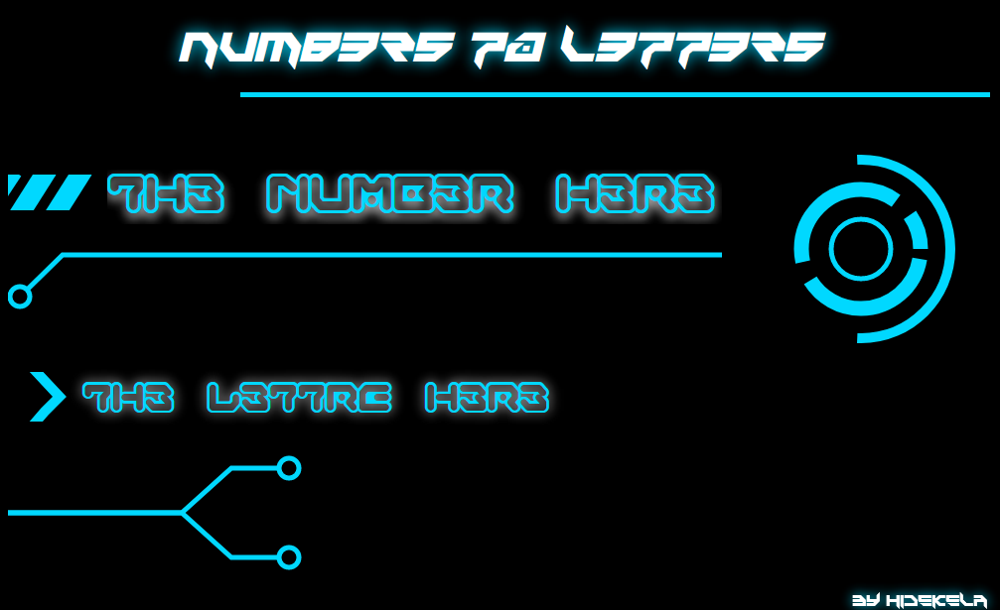

# NUM83R5 70 L3773R5

_Convertisseur de nombre en lettres_

## Introduction

L'idée est venu quand on a fait des saisies de plusieurs factures. Lire la somme total et l'écrire en toutes lettres étaient assez ennuyeux. Utiliser ceci fera gagner du temps et économisera notre énergie. :smile:

## Pré-requis

Un navigateur web (Mozilla Firefox, Google Chrome, Internet Explorer 11, ...)

## Utilisation

1. Ouvrez NUM83R5 70 L377R35.html avec un navigateur
    - après avoir [téléchargé NUM83R5 70 L377R35](https://github.com/Hidekela/NUM83R5-70-L3773R5/releases/download/v1.0.0/NUM83R5.70.L3773R5.v1.0.0.zip)
            ou
    - en ligne par ce lien: [https://hidekela.github.io/NUM83R5-70-L3773R5/NUM83R5_70_L3773R5.html](https://hidekela.github.io/NUM83R5-70-L3773R5/NUM83R5_70_L3773R5.html)
2. Copiez le nombre que vous voulez convertir
3. Rendez vous dans l'onglet de NUMBERS TO LETTERS 
4. Faites la combinaison des touches ``CTRL + V``
5. Rendez vous à l'endroit où vous voulez coller les lettres
6. Collez

_(NB: Vous n'avez plus besoin de sélectionner et de copier les lettres affichés, ils le sont déjà automatiquement. Suivez juste l'étape 2 à 6)_

## Limite

Ne peut pas convertir les nombres dépassant les 999 milliards (+ 999.999.999) et ne tient pas compte les chiffres après virgule.

## Fabriqué avec

* HTML
* CSS
* JavaScript
* [game-battles-2.ttf](https://www.freebestfonts.com/game-battles-font)
* [FontsFree-Net-GAMEG___.ttf](https://fontsfree.net/gameboy-gamegirl-font-download.html)

## Licence

Ce projet est sous licence ``MIT`` - voir le fichier [LICENSE-MIT](LICENSE-MIT) pour plus d'informations

***Enjoy!*** :wink: